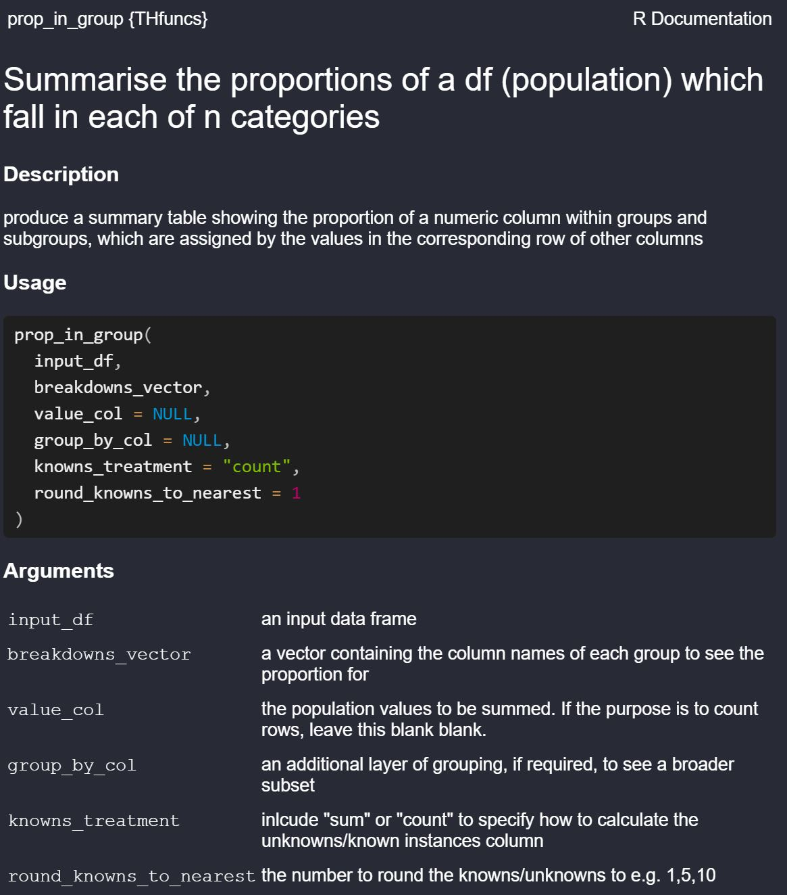

```{r, include = FALSE}
knitr::opts_chunk$set(
  collapse = TRUE,
  warnings = FALSE,
  message=FALSE,
  fig.path = "man/figures/README-",
  out.width = "100%"
)
library(devtools)
#devtools::install_github("tomambroseharris/THfuncs", force = TRUE)
library(THfuncs)

```


# THfuncs


# Purpose

The THfuncs R package contains functions created to help with data analysis, data manipulation and other functionality in R. 

The first (and currently only function) contained in this package is `prop_in_group()`. This function transforms tidy data into a grouped proportion table, using columns in the data. It can be generalised to summarise wide data frames, as shown in the examples below. 

# Installation

You can install the development version of THfuncs like so:


```{r, echo = TRUE, eval=FALSE}
# install.packages("devtools")
library(devtools)
devtools::install_github("tomambroseharris/THfuncs", force = TRUE)
library(THfuncs)
```


## prop_in_group

See what the function does by running: `?prop_in_group()`
The inputs are shown in `Usage`. There are defaults, which mean that the only  arguments necessary to specify are the `input_df` and `breakdowns_vector`. 

```{r, echo = FALSE}
library(knitr)


```

# Example use

We will use some dummy data on universities, shown below.

```{r, echo = FALSE}
# source: HESA 2020/21; PUBLISHED HE provider spine August 2022
library(dplyr)
library(kableExtra)
library(utils)


universities <- tibble::tribble( ~`UKPRN`, ~`Name`, ~`Country`, ~`Ofs_Tariff_1920`, ~`TEF_1819`, ~`Student numbers`, ~`Total Expenditure`,
        10007814, "Cardiff University", "Wales", "",   "Silver",  33510, 573201,
        10007790, "The University of Edinburgh", "Scotland", "",   "No TEF", 37830, 1060066,
        10007794, "The University of Glasgow", "Scotland", "",   "No TEF", 37145, 695820,
        10000291, "Anglia Ruskin University",  "England", "Low Tariff",   "Silver", 32180, 270231,
        10008640, "Falmouth University",  "England", "Specialist HEI",     "Gold", 6170, 64303,
        10007760, "Birkbeck College",  "England", "Specialist HEI",   "Silver", 12070, 106783,
        10007792, "University of Exeter",  "England", "High Tariff",     "Gold", 30250, 512915,
        10007799, "University of Newcastle",  "England", "High Tariff",       "Gold", 27775, 530603,
        10007154, "University of Nottingham",  "England", "High Tariff",       "Gold", 35785, 683714)     %>%                             
                                 
                                 
                                 mutate_all(na_if,"") 


kableExtra::kbl(universities, format = "pipe")
```

### Example 1. - Basic

Showing the proportion of observations (rows) that have each breakdown.

```{r, echo=TRUE, eval=FALSE}

prop_in_group(input_df = universities,
              breakdowns_vector = c("Country", "Ofs_Tariff_1920", "TEF_1819"))

```


```{r, echo=FALSE, eval=TRUE}

kableExtra::kbl(prop_in_group(input_df = universities,
              breakdowns_vector = c("Country", "Ofs_Tariff_1920", "TEF_1819")),
              format = "pipe")

```

**Notes:**
*Only the rows for which the data points are known will be included in the calculation, therefore ensuring that the proportion sums to 1 within each grouping.*

### Example 2a. - Proportion of student numbers

Showing the proportion of observations (rows) that have each breakdown. SUM how much of the total is known.

```{r, echo=TRUE, eval=FALSE}

prop_in_group(input_df = universities,
              breakdowns_vector = c("Country", "Ofs_Tariff_1920", "TEF_1819"),
              value_col = `Student numbers`,
              knowns_treatment = "sum")

```


```{r, echo=FALSE, eval=TRUE}

kableExtra::kbl(prop_in_group(input_df = universities,
              breakdowns_vector = c("Country", "Ofs_Tariff_1920", "TEF_1819"),
              value_col = `Student numbers`,
              knowns_treatment = "sum"),
              format = "pipe")

```

### Example 2b. - Proportion of student numbers

Showing the proportion of observations (rows) that have each breakdown. COUNT how many rows have known values. (This is the default, as shown in example 1).

```{r, echo=TRUE, eval=FALSE}

prop_in_group(input_df = universities,
              breakdowns_vector = c("Country", "Ofs_Tariff_1920", "TEF_1819"),
              value_col = `Student numbers`,
              knowns_treatment = "count")

```


```{r, echo=FALSE, eval=TRUE}

kableExtra::kbl(prop_in_group(input_df = universities,
              breakdowns_vector = c("Country", "Ofs_Tariff_1920", "TEF_1819"),
              value_col = `Student numbers`,
              knowns_treatment = "count"),
              format = "pipe")

```
### Example 2c. - Rounded knowns

Now we change the input parameter `round_knowns_to_nearest` from 1 (the default) to 5. 

```{r, echo=TRUE, eval=FALSE}

prop_in_group(input_df = universities,
              breakdowns_vector = c("Country", "Ofs_Tariff_1920", "TEF_1819"),
              value_col = `Student numbers`,
              knowns_treatment = "count",
              round_knowns_to_nearest = 5)

```


```{r, echo=FALSE, eval=TRUE}

kableExtra::kbl(prop_in_group(input_df = universities,
              breakdowns_vector = c("Country", "Ofs_Tariff_1920", "TEF_1819"),
              value_col = `Student numbers`,
              knowns_treatment = "count",
              round_knowns_to_nearest = 5),
              format = "pipe")

```


### Example 3. - Dual breakdowns

Now we will derive the proportion in each group split by the unique variables in the `Country` column.

```{r, echo=TRUE, eval=FALSE}

prop_in_group(input_df = universities,
              breakdowns_vector = c("TEF_1819"),
              value_col = `Student numbers`,
              group_by_col = Country,
              knowns_treatment = "count")

```


```{r, echo=FALSE, eval=TRUE}

kableExtra::kbl(prop_in_group(input_df = universities,
              breakdowns_vector = c("TEF_1819"),
              value_col = `Student numbers`,
              group_by_col = Country,
              knowns_treatment = "count"),
              format = "pipe")

```

**Notes**
*Where there are no corresponding data in the original data frame (e.g., No Welsh universities in the df were TEF_1819 = Gold), NA will be returned*


### Example 4. - Minimalist table without knowns and within pipe

This table summarises the proportion of universities in each tariff group. Instead of ignoring NA values, we can reassign these values such that they are included in the proportion calculation. If this is the case, we might as well remove the `Known in Group` and `Unknowns` columns (because these would be Known = 9 and Unknowns = 0 in each instance).

This table also shows how the function can be nested within a pipe: it assumes that the input data frame is that which is being manipulated.  

```{r, echo=TRUE, eval=TRUE}


output_df <- universities %>%
  mutate(Ofs_Tariff_1920 = if_else(is.na(Ofs_Tariff_1920), "UNKNOWN TARIFF", Ofs_Tariff_1920)) %>%
  prop_in_group(breakdowns_vector = c("Ofs_Tariff_1920"),
                include_knowns = "no") 

```


```{r, echo=FALSE, eval=TRUE}


kableExtra::kbl(output_df,
              format = "pipe")

```


Test

```{r, echo=FALSE, eval=TRUE}


kableExtra::kbl(prop_in_group(input_df = universities,
              breakdowns_vector = c("TEF_1819"),
              value_col = `Student numbers`,
              value_or_prop = "value",
              group_by_col = Country,
              knowns_treatment = "count"),
              format = "pipe")

```


